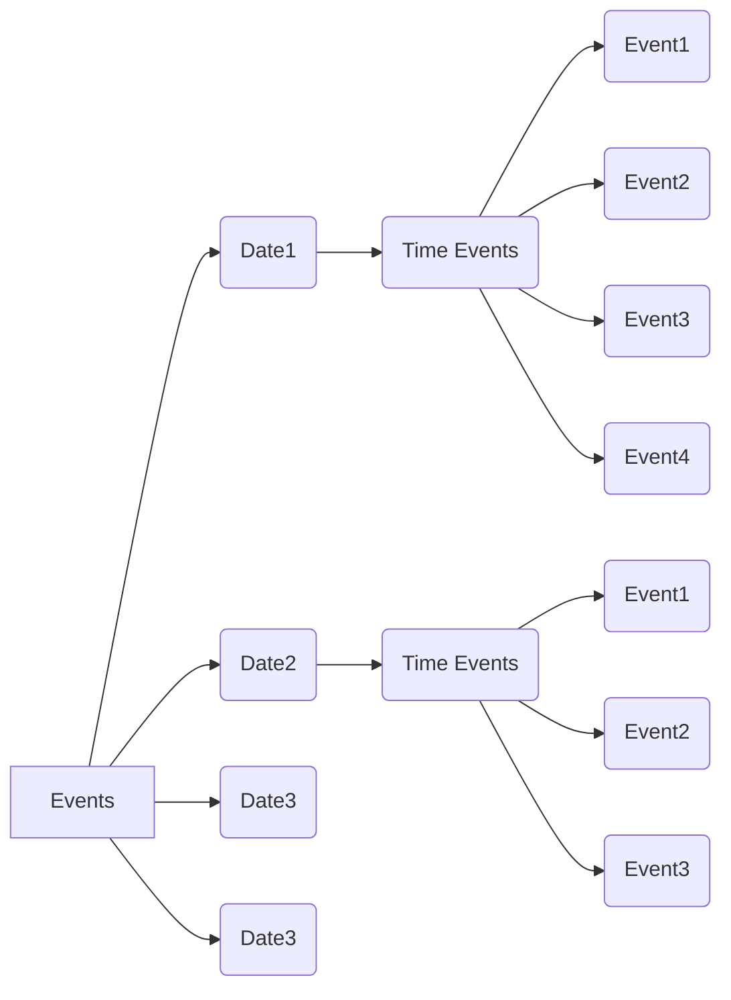

# Appointment Booking API

## API End Points

**FreeSlots**

```javascript
Method : POST
End Point : http://localhost:5000/api/freeSlots
Body : 	{
			"date"    : "2020-11-23",
			"timezone": "Asia/Kolkata"
		}
```

**Create Event**

```javascript
Method : POST
End Point : http://localhost:5000/api/createEvent
Body : 	{
		    "datetime": "2020-11-23T22:00:00",
		    "duration": 30,
		    "timezone": "Asia/Kolkata"
		}
```

**Get Events**

```javascript
Method : POST
End Point : http://localhost:5000/api/getEvents
Body : 	{
		    "startdate": "2020-11-23",
		    "enddate"  : "2020-11-23"
		}
```

## How to Run Locally

Use this command: [https://github.com/sayeed38/appointment-booking-backend.git](https://github.com/sayeed38/appointment-booking-backend.git)\

1. Create a new project in [Firebase](https://firebase.google.com/)
2. Create database in Cloud Fire Store.
3. Select test mode and click the enable button.
4. Download the service account JSON File from Project Overview/Project Settings/Firebase Admin SDK and paste it in the utils folder of the project with name as ServiceAccountKey.json .

Change Directory in the terminal: `cd appointment-booking-backend`\
Install all dependencies: `npm install`

### `npm start`

Runs the app in the development mode.\
Open [http://localhost:5000](http://localhost:3000) to view it in the browser.

Test the app using Postman.

## Database Structure

Event (Collection) --> Date (Document) --> Time Events (Collection) --> Event1 (Document)



Queries Used:
set(), add() for adding the data in the database.
get() for fetching the data from the database.

### Appointments Across the Globe:

If a user from other country gets an event on a particular date it should get the event in the specific country's time zone and while adding to the database it should be converted into the appointee's country zone.
